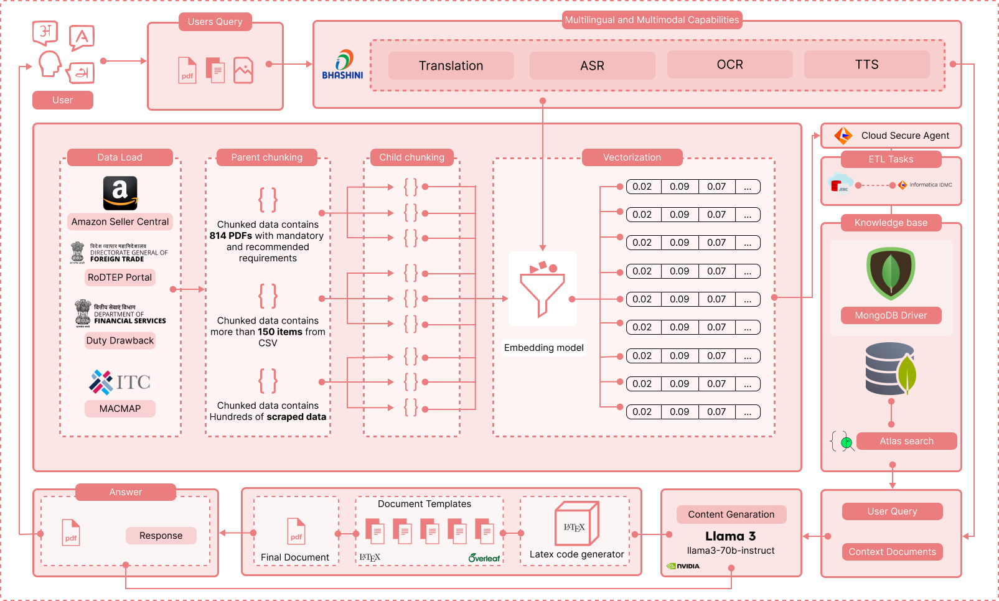
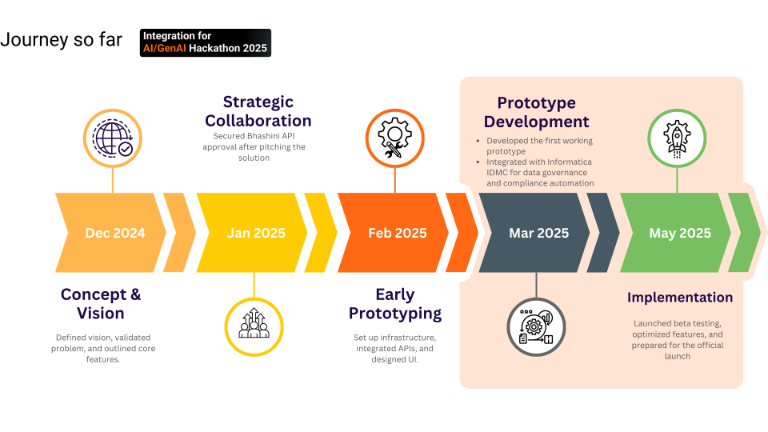

<p align="center">
    <a href="https://justprompt.vercel.app/">
        
    </a></p>
<p align="center"><h1 align="center">JUSTPROMPT.AI X INFORMATICA</h1></p>
<p align="center">
	
	
	
</p>
<br>

## Table of Contents

- [Overview of JustPrompt.ai](#overview-of-justpromptai)
- [Challenges Faced by MSMEs](#challenges-faced-by-msmes)
- [Solution Architecture](#solution-architecture)
- [Core Values of JustPrompt](#core-values-of-justprompt)
- [Project Structure](#project-structure)
  - [Client](#client)
  - [Server](#server)
- [Getting Started](#getting-started)
- [Project Roadmap](#project-roadmap)
---

## Overview of JustPrompt.ai

**JustPrompt.ai** is an AI-powered platform designed to simplify cross-border trade for SMEs (Small and Medium-sized Enterprises). It provides comprehensive compliance guidance and various features to help SMEs overcome challenges in entering global markets.

## Challenges Faced by MSMEs

MSMEs encounter several obstacles when trying to expand globally, including:

- **Complex cross-border regulations**
- **Difficulty accessing government incentives**
- **High costs for building an online presence**
- **Expensive compliance with international standards**
- **Limited access to market research tools**

---

## Solution Architecture


---

## Core Values of JustPrompt

JustPrompt tackles these challenges with the following features:

1. **Cross-Border Regulatory Compliance** - Simplifies understanding and adherence to complex trade regulations.
2. **Comprehensive Market Research** - Provides SMEs with detailed market insights for informed decision-making.
3. **GenAI-Powered Document Generation** - Uses AI to automate necessary trade documentation.
4. **Pre-built Templates for Online Presence** - Offers ready-to-use templates for quick online business setup.

---

## Project Structure

The project is organized into two main directories: `client` and `server`.

### Client

The `client` directory houses the frontend code of the JustPrompt platform.

```plaintext
client/
 ├── .catalystrc
 ├── .gitignore
 ├── catalyst.json
 ├── package.json
 ├── postcss.config.js
 ├── README.md
 ├── tailwind.config.js
 ├── public/
 │   ├── favicon.ico
 │   ├── index.html
 │   ├── logo192.png
 │   ├── logo512.png
 │   ├── manifest.json
 │   ├── robots.txt
 ├── src/
 │   ├── App.css
 │   ├── App.js
 │   ├── App.test.js
 │   ├── Chatbot.js
 │   ├── cleaned_components.json
 │   ├── codebase.json
 │   ├── ...
```

### Server

The `server` directory contains the backend code of JustPrompt.

```plaintext
server/
 ├── .catalystrc
 ├── app-config.json
 ├── catalyst-debug.log
 ├── catalyst.json
 ├── generate-billoflading.js
 ├── generate-responses.js
 ├── get-embeddings.js
 ├── index.js
 ├── package.json
 ├── README.md
 ├── models/
 │   ├── ...
```

---

## Getting Started

Follow these steps to get started with the platform:  
<a href="https://www.youtube.com/watch?v=hUBCP1Kzpfc" target="_blank">
  
</a>

---

## Project Roadmap


---